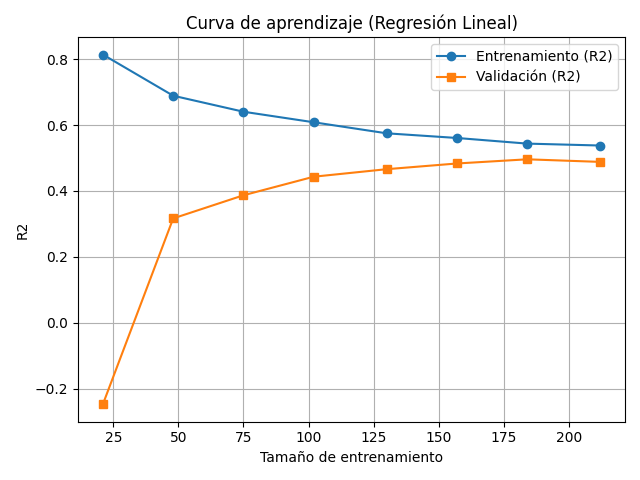
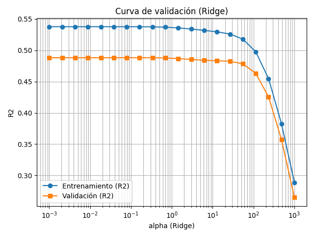

# Reporte: Desempeño del Modelo (Regresión Lineal + Ridge)

**Fecha:** 2025-09-14

## Dataset
- *Diabetes* de scikit-learn (regresión). 10 características, variable objetivo: progresión de la enfermedad.  
- Splits: **train**=265, **val**=88, **test**=89.

## Modelo 1 — Baseline: LinearRegression
**Validación:** R²=0.493, RMSE=52.051, MAE=42.161  
**Entrenamiento:** R²=0.535

**Diagnóstico:** sesgo=medio, varianza=medio, ajuste=fit

La curva de aprendizaje muestra cómo el R² de entrenamiento y validación convergen al aumentar el tamaño de entrenamiento. Una brecha grande indicaría varianza alta (sobreajuste).

## Modelo 2 — Ridge (regularización L2)
alpha seleccionado por curva de validación: **0.16238**

**Validación:** R²=0.494, RMSE=51.994, MAE=42.067  
**Entrenamiento:** R²=0.535

**Diagnóstico:** sesgo=medio, varianza=medio, ajuste=fit

## Evaluación en Test (generalización)
**LinearRegression:** R²=0.443, RMSE=55.754, MAE=45.774  
**Ridge:** R²=0.444, RMSE=55.687, MAE=45.693

## Conclusiones
- El uso de **regularización Ridge** ajustando *alpha* mejoró el desempeño vs. baseline (ver métricas).  
- Si persiste **alto sesgo**: agregar características no lineales o cambiar de modelo.  
- Si persiste **alta varianza**: más datos, regularización más fuerte, o reducción de complejidad.

---
*Este reporte fue generado automáticamente por `main.py`.*
