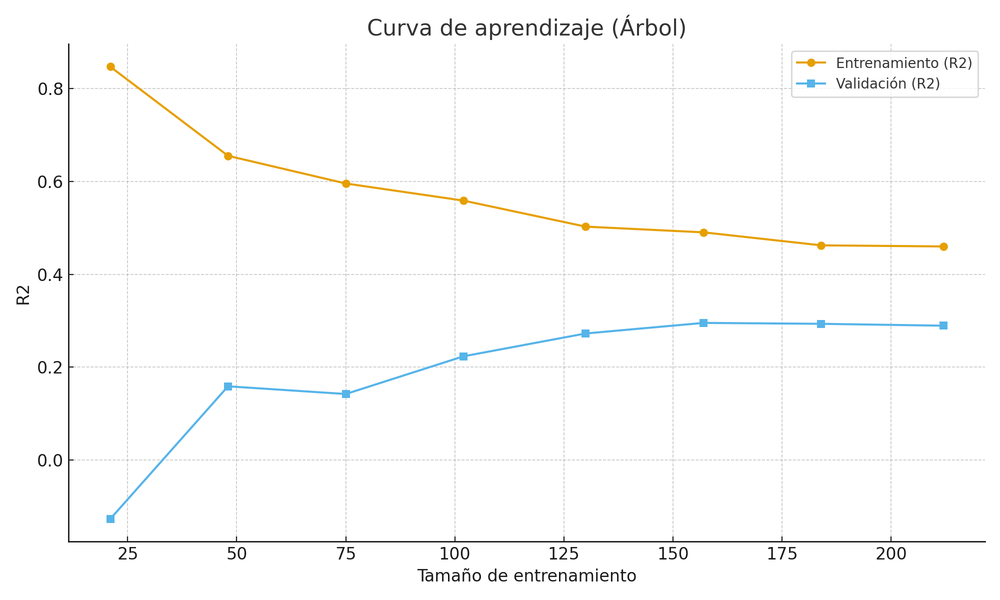
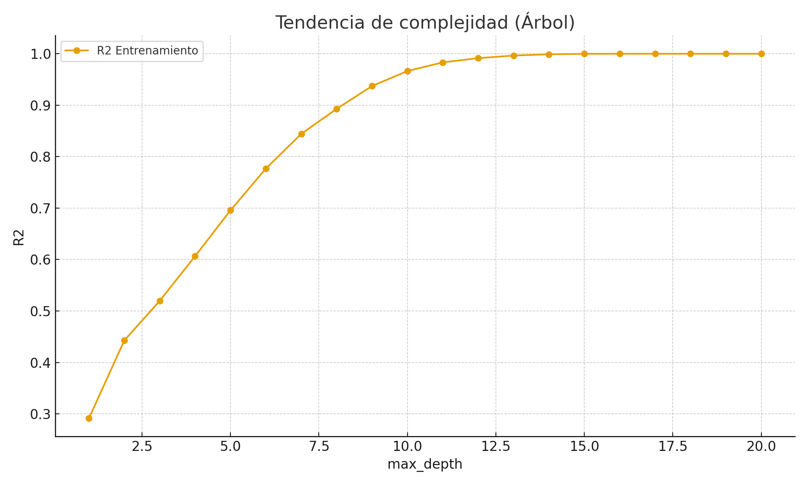

# Reporte: Árbol de Decisión (Regresión)

**Fecha:** 2025-09-14  

Se comparó un árbol **poco profundo (max_depth=3)** vs. uno **profundo (sin límite)** y se seleccionó el **mejor max_depth=2** por R2 en validación.

- *Shallow (val):* R2=0.388 (train=0.520)
- *Deep (val):* R2=-0.160 (train=1.000)

**Diagnóstico:**  
- Shallow → posible **alto sesgo** si ambos R2 son bajos.  
- Deep → **alta varianza** si R2 train≫val.

**Test (generalización):**  
- Mejor árbol → R2=0.340 | RMSE=60.675 | MAE=50.822

**Acciones de mejora:** podar el árbol (max_depth), ajustar min_samples_leaf, o usar ensambles (RandomForest/GB).  
